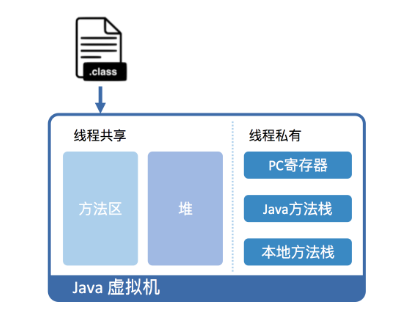
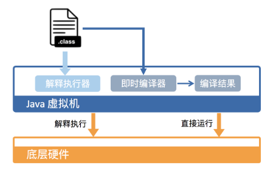

Java 是怎么运行的？

> Java 文件编译成字节码（class）文件，然后把class文件放到虚拟机里面运行。

Java 虚拟机具体是怎么去运行 Java 字节码的？

以标准 JDK 中的 HotSpot 虚拟机为例，从虚拟机和硬件两个角度去看：

从虚拟机视角来看，首先将字节码 class 文件加载进 Java 虚拟机，加载后的 Java 类会被放到方法区（Method Area）里，等到实际运行的时候，虚拟机会执行方法区里的代码。

Java 虚拟机在内存里划分出堆和栈来存储运行时的数据。如上图所示，其中本地方法栈存储的是用 C++ 写的 native 方法，PC 寄存器存在各个线程的执行位置。运行时，每当调用进入一个 Java 方法，Java 虚拟机就会在当前线程的 Java 方法栈中生成一个栈帧，用来存放局部变量和字节码的操作数。退出当前的方法后，就会弹出当前的栈帧，并且丢弃。

从硬件视角来看，Java 字节码是无法直接运行在机器上的，需要 Java 虚拟机去把字节码翻译成机器码再去执行。

在 HotSpot 里，上述编译过程有两种方式：（1）解释执行，就是对于字节码翻译成机器码，它是每翻译一条，就执行一条。（2）即使编译（Just-In-Time compilation，JIT），就是将一个方法中包含的所有字节码都编译成机器码后，再执行。HotSpot 默认采用混合模式，它会先解释执行字节码，然后对其中一些反复执行的热点代码，以方法为单位进行即时编译。

HotSpot 内置了多个即时编译器：C1、C2和Graal。其中 Graal 是 Java 10 正式引入的实验性即时编译码。C1 又叫做 Client 编译器，面向的是启动性能有要求的客户端 GUI 程序，采用的优化手段相对简单，因此编译时间较短。C2 又叫做 Server 编译器，面向的是对峰值性能有要求的服务器端程序，采用的优化手段相对复杂，因此编译时间较长，但同时生成的代码的执行效率较高。

从 Java 7 开始，HotSpot 默认采用分层编译的方式：热点代码首先会被 C1 编译，而后热点方法中的热点会进一步被 C2 编译。